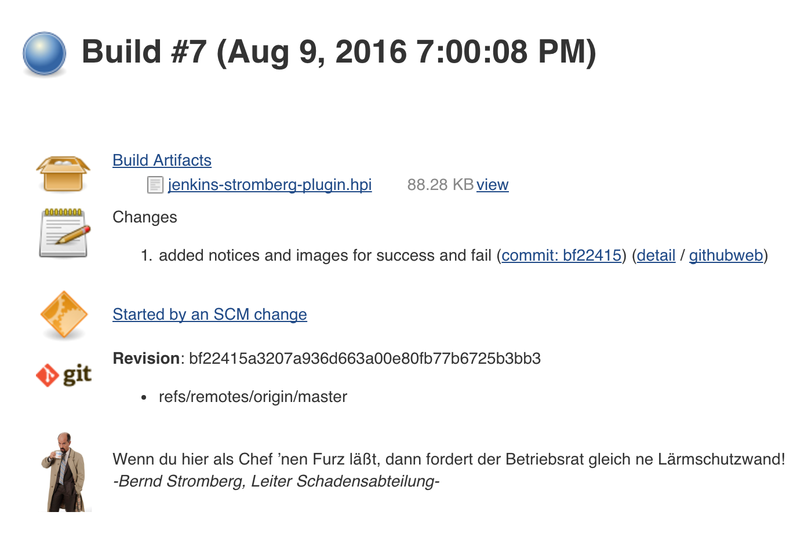

# Stromberg for Jenkins

In Anlehnung an das beliebte Chuck Norris Plugin für Jenkins kommt hier der Chuck Norris der Capitol Versicherung, seines Zeichens Leiter der Schadensregulierung.
Sowohl für erfolgreiche als auch für gescheiterte Builds gibt es eine Weisheit des nach eigenen Angaben besten Chefs der Welt.

## Bauen & Deployen
Einfach per <pre><code>mvn clean verify</code></pre> bauen und die HPI Datei dann auf dem Jenkins installieren.

## Jenkins Build Summary
Bei installiertem Plugin gibts dann auf der Build Summary Seite einen neuen Eintrag.

